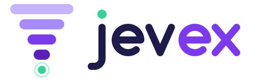
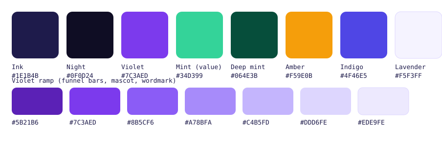

# jevex brand

<picture>
  <source media="(prefers-color-scheme: dark)" srcset="jevex-logo-dark.svg">
  
</picture>

The logo is concept **A · Funnel** from [`concepts/`](concepts/), and the mascot comes
from concept **C** (owner's decision on #57). Four bars narrow, document → component →
statement → value, into the found value (mint). The same shape reads as a falling bar
chart: fewer LLM calls on every run. In the wordmark, the value is the dot on the j.

## Files

The SVGs are the sources. Run `uv run scripts/render_brand.py` to re-render the PNGs and
the ICO after changing them.

| File | Use |
| --- | --- |
| [`jevex-logo.svg`](jevex-logo.svg) | Logo (mark + wordmark) on light backgrounds |
| [`jevex-logo-dark.svg`](jevex-logo-dark.svg) | Logo on dark backgrounds |
| [`jevex-mark.svg`](jevex-mark.svg) · [`jevex-mark-dark.svg`](jevex-mark-dark.svg) | The mark alone, when the name is already beside it |
| [`jevex-icon.svg`](jevex-icon.svg) · [`jevex-icon-512.png`](jevex-icon-512.png) | App icon and avatar: the mark on an ink tile, readable on any background |
| [`favicon.svg`](favicon.svg) · [`favicon.ico`](favicon.ico) | Favicon (16, 32 and 48 px in the ICO) |
| [`social-preview.png`](social-preview.png) | GitHub social preview, 1280×640 (source: [`social-preview.svg`](social-preview.svg)) |
| [`mascot.svg`](mascot.svg) | Jev-ex, the mascot, for the README, illustrations and animations |
| [`palette.svg`](palette.svg) | The palette as swatches |

To use the social preview, upload `social-preview.png` under the repository's
**Settings → General → Social preview**. The settings page is the only place to set it.
Unlike the logo, its two text lines are live text in Nunito, falling back to Avenir Next
and then system-ui. The committed PNG was rendered with Avenir Next.

For a README that follows the reader's theme:

```html
<picture>
  <source media="(prefers-color-scheme: dark)" srcset="docs/brand/jevex-logo-dark.svg">
  
</picture>
```

## Colours



| Colour | Hex | Role |
| --- | --- | --- |
| Ink | `#1E1B4B` | Wordmark "jev" on light, body text, the icon tile |
| Night | `#0F0D24` | Dark backgrounds |
| Lavender | `#F5F3FF` | Wordmark "jev" on dark |
| Violet | `#7C3AED` | The brand colour: "ex" on light, links, accents |
| Violet ramp | `#5B21B6` `#7C3AED` `#8B5CF6` `#A78BFA` `#C4B5FD` `#DDD6FE` `#EDE9FE` | Funnel bars, the mascot (`#8B5CF6`), "ex" on dark (`#A78BFA`) |
| Mint | `#34D399` | **The value** and nothing else: the funnel's last step, the j's dot, the mascot's badge, and "resolved without an LLM" in charts |
| Deep mint | `#064E3B` | Text or marks on mint |
| Amber | `#F59E0B` | Illustration accent; suggested for LLM calls, so they contrast with mint |
| Indigo | `#4F46E5` | Secondary illustration accent |

The funnel's bars always get more contrast toward the value. On light backgrounds they
run `#C4B5FD` → `#A78BFA` → `#7C3AED` → `#5B21B6`. On dark backgrounds they run the other
way, `#5B21B6` → `#7C3AED` → `#A78BFA` → `#DDD6FE`, so the dimmest bar is still the
widest. On the ink icon tile they run `#7C3AED` → `#A78BFA` → `#C4B5FD` → `#EDE9FE`.

## Type

- **Wordmark:** custom drawn round-capped strokes (14 units on a 64-unit x-height), not
  a font. Don't retype "jevex" in a font as a logo.
- **Headings** in graphics, slides and the website: [Nunito](https://fonts.google.com/specimen/Nunito)
  ExtraBold (800) or Bold (OFL), whose rounded terminals match the wordmark. Fall back to
  `ui-rounded, system-ui, sans-serif`.
- **Body:** `system-ui, sans-serif`.
- **Code and values:** `ui-monospace, Menlo, monospace`.

## Usage

- **Clear space:** keep at least the height of one funnel bar clear around the logo (a
  sixth of the mark's width).
- **Minimum size:** the logo 120 px wide, the mark 24 px. Below 24 px, use the favicon,
  which simplifies the mark to three bars.
- **Pick the variant for the background:** the light logo on light backgrounds, the dark
  logo on dark ones. On photos or busy backgrounds, use the icon.
- **Don't** recolour, stretch, rotate, outline, add shadows to or rearrange the logo, and
  don't use mint for anything other than the value.
- **The mascot** is the character, not the logo. Use it in the README, illustrations
  (#58), animations (#59) and stickers; keep the logo for identifying the project. Its
  badge says "value found" (a check). Don't put example data such as "9.1s" on it, so
  the brand isn't tied to one domain.
