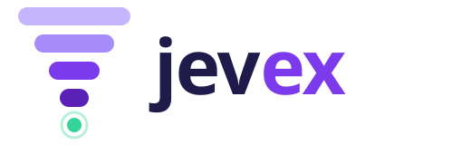
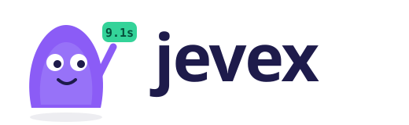

# Logo concepts (#57)

Three directions to choose from. They're all rough: the wordmark uses a system rounded
font, and it gets converted to outlines once a direction is picked.

| | Concept | Idea |
|---|---|---|
|  | **A · Funnel** | Four bars narrowing, document → component → statement → value, ending in the glowing value. It also reads as a falling bar chart: fewer LLM calls every run. The most "about the product" of the three. |
|  | **B · Lens** | A magnifier over a document; inside the lens only the one value lights up. The most instantly legible, and the most generic. |
|  | **C · Mascot** | A friendly extractor holding up the value it found. The most fun, and gives stickers, README art and animations a character to reuse. |

Palette: ink `#1E1B4B`, violet `#7C3AED` / `#8B5CF6` / `#A78BFA` / `#C4B5FD`, indigo
`#4F46E5`, mint (value) `#34D399`, amber `#F59E0B`.

Mixing is possible, for example A's mark as the icon with C as the README mascot.
Once a direction is picked: final mark and outlined wordmark, light/dark SVGs, favicon,
the 1280×640 GitHub social preview, and a one-page brand sheet.
